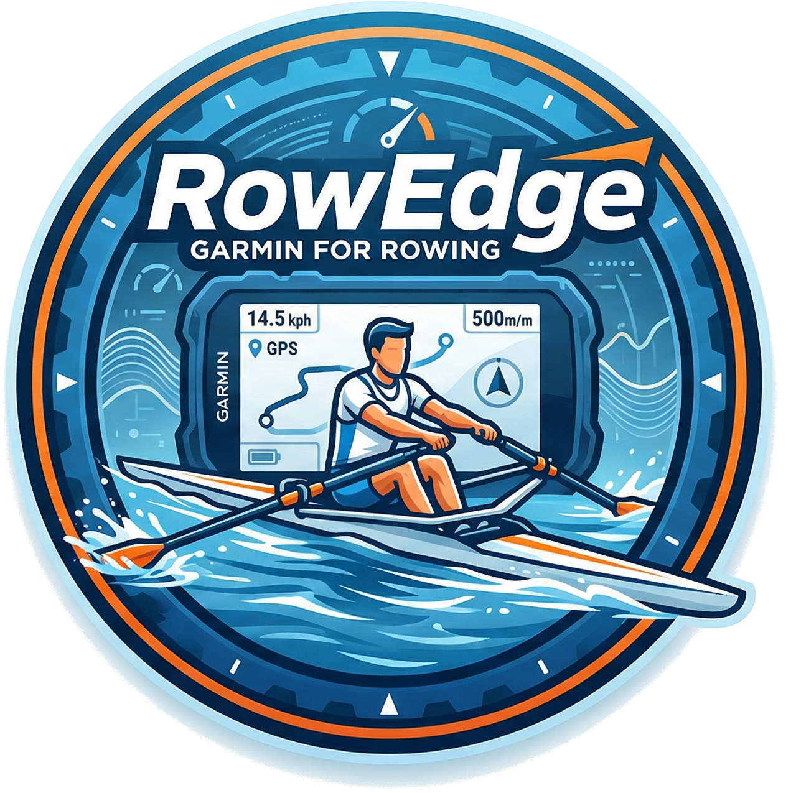
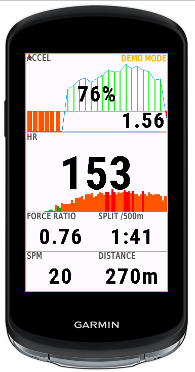
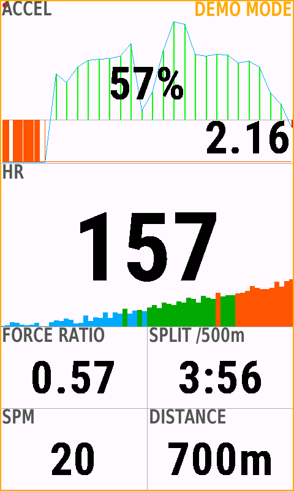
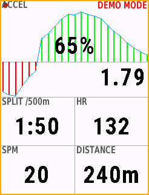
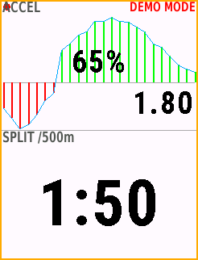
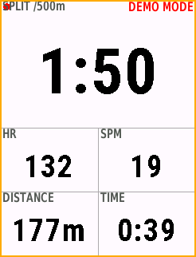
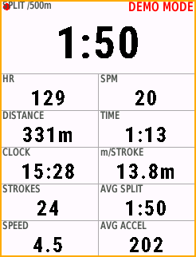

# RowEdge - Outdoor Rowing App for Garmin Edge

<p align="center">
  
</p>

[**Install from Connect IQ Store**](https://apps.garmin.com/apps/9064c795-03e1-4424-aa4e-e5033e03dbcf)

An open-source Connect IQ app that turns Garmin Edge cycling computers into
outdoor rowing performance computers.

## Screenshots

<p align="center">
  
  
</p>
<p align="center">
  
  
  
  
</p>

## Why?

Outdoor rowing has very few sport performance computers. The dominant product
(NK SpeedCoach GPS, $400+) is expensive and limited. Meanwhile, many athletes
already own a Garmin Edge for cycling. RowEdge repurposes it for rowing with
features specific to the sport.

## Features

### Core Rowing Metrics
- **Split time /500m** from GPS distance (10s sliding window, proper v=dx/dt)
- **Stroke rate (SPM)** from forward acceleration -- event-based interval averaging
- **Heart rate** from paired ANT+ HR sensor
- **Activity recording** as FIT SPORT_ROWING with custom fields

### Acceleration Curve (Force Curve Proxy)
- **Real-time stroke graph** -- 70/30 asymmetric Y-scaling (drive gets 70% of height)
- **Orange clip indicator** for deep catches -- proportional width shows severity
- **Force ratio (FR%)** overlaid on drive curve -- stroke quality at a glance
- **Delta-V** -- velocity gained per stroke (impulse)
- **7 stroke metrics** as data fields: FR, delta-V, D:R ratio, drive time, catch duration, catch slope, peak accel

### Radar Obstacle Detection
- **Varia ANT+ radar** -- forward-facing on bow, detects approaching objects
- **Smart classification** -- STATIONARY (buoy/dock), ONCOMING (head-on), OVERTAKING
- **TTC-based alerts** -- time-to-collision with per-class thresholds, 3-hit persistence
- **Visual warning** -- colored bar (red/orange/green) + range + TTC on data screen
- **Radar data field** -- colored background by threat level, ONC shown in red

### UI and Configuration
- **Wahoo-style zoom** -- swipe up/down or UP/DOWN buttons, z1-z7
- **Multi-device** -- Edge 540, 840, 1040, 1050 with per-device fonts and layout
- **Touch support** -- swipe zoom, tap-to-configure, Picker for threshold, Menu2 for zoom
- **Secondary hero** -- tall screens (1040/1050) show two full-width hero fields
- **Configurable data fields** -- reorder, add, remove, Move to Top via menu
- **Auto gravity calibration** -- 2-second static sampling with 300ms settle delay
- **Auto-pause/resume** -- GPS speed based with holdoff/cooldown hysteresis
- **Pause display** -- distance, time, avg split, clock
- **Activity summary** -- shown for 10s after save

### Advanced Features
- **Sparkline graphs** -- 60s zone-colored bar history in hero fields (split, HR, SPM, FR, dV)
- **Forward acceleration detection** -- orientation-aware boat vector from gravity calibration
- **Demo mode** -- real on-water stroke replay (5 intensity types) on Dorney Lake course
- **High-frequency accel logging** -- 25Hz forward accel packed to FIT (13 SINT32 fields)
- **Rowing metrics logging** -- per-stroke FR, delta-V, D:R, catch metrics to FIT
- **Radar raw logging** -- 8 targets range/speed + threat level to FIT
- **Feature toggles** -- auto-pause, demo, curve metrics, accel/HF/rowing log
- **FIT data extraction** -- Python tool with gnuplot visualization (tools/fit_extract.py)

## Supported Devices

- Garmin Edge 540 / 540 Solar (246x322, button-only)
- Garmin Edge 840 (246x322, buttons + touch)
- Garmin Edge 1040 / 1040 Solar (282x470, touch + 3 buttons)
- Garmin Edge 1050 (480x800, touch + 3 buttons)

## Available Data Fields

| Field             | Source                          |
|-------------------|---------------------------------|
| Accel Curve       | 25Hz forward accel graph        |
| Split /500m       | GPS distance                    |
| Stroke Rate (SPM) | Forward acceleration            |
| Heart Rate        | ANT+ sensor                     |
| Distance          | GPS                             |
| Elapsed Time      | Timer                           |
| Time of Day       | System clock                    |
| Meters/Stroke     | GPS + accel                     |
| Stroke Count      | Forward acceleration            |
| Speed             | GPS                             |
| Avg Split         | Calculated                      |
| Force Ratio       | Stroke curve (avg/peak, 0-100%) |
| Delta-V           | Stroke impulse (m/s)            |
| D:R Ratio         | Drive:Recovery time ratio       |
| Drive Time        | Stroke curve                    |
| Catch Duration    | Stroke curve                    |
| Catch Slope       | Stroke curve (mG/s)             |
| Peak Accel        | Stroke curve (mG)               |
| Avg/Max Accel     | Accelerometer (calibration)     |

## Zoom Levels

Wahoo-style zoom matching real ELEMNT behavior:

| Zoom | Fields | Layout                |
|------|--------|-----------------------|
| z1   | 1      | Full screen           |
| z2   | 2      | Hero + 1 row          |
| z3   | 3      | Hero 40% + 2 rows 30% |
| z4   | 5      | Hero + 2x2 grid       |
| z5   | 7      | Hero + 2x3 grid       |
| z6   | 9      | Hero + 2x4 grid       |
| z7   | 11     | Hero + 2x5 grid       |

## Button / Touch Mapping

| Action | Edge 540/840 Button | Edge 1040/1050 Touch | During |
|--------|--------------------|--------------------|--------|
| Start/Pause/Resume | Start/Stop (bottom-right) | Start/Stop (bottom-right) | Any |
| Lap / Save dialog | Lap (bottom-left) | Lap (bottom-left) | Recording/Paused |
| Zoom in | UP button | Swipe down | Recording |
| Zoom out | DOWN button | Swipe up | Recording |
| Settings | Enter/OK or long-press UP | Tap screen | Idle/Paused |

## Build

Requires Connect IQ SDK 9.1.0+ and Python 3 + Pillow.

```bash
make build           # compile for Edge 540
make fonts           # regenerate bitmap fonts from TTF
make run_simulator   # build + launch simulator + load app
make deploy          # copy to USB-connected Edge device
make clean           # remove build artifacts
```

## Install on Device

```bash
# Connect Edge 540 via USB, then:
make deploy
# Eject device. App appears in Connect IQ apps list.
```

## Configuration

Press MENU to access settings:
- **Data Fields**: reorder, add, remove fields (priority order)
- **Threshold**: stroke detection sensitivity (milliG, default 200)
- **Zoom Level**: number of visible fields
- **Features**: toggle auto-pause, demo mode, curve metrics, accel/HF/rowing log

## TODO
- [ ] Radar alert threshold settings (configurable distances)
- [ ] Phone settings via settings.xml
- [ ] Interval workouts
- [ ] [OpenSmartOar](../OpenSmartOar.project/): SmartHub + BLE oar sensors + obstacle detection

## License

GPLv3. See LICENSE file.
